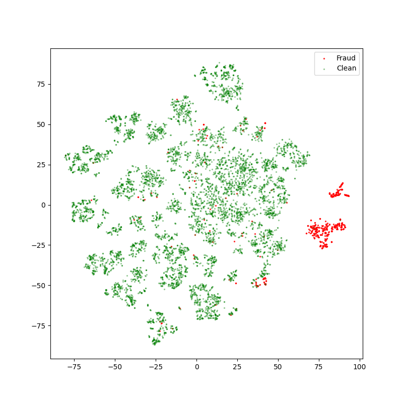
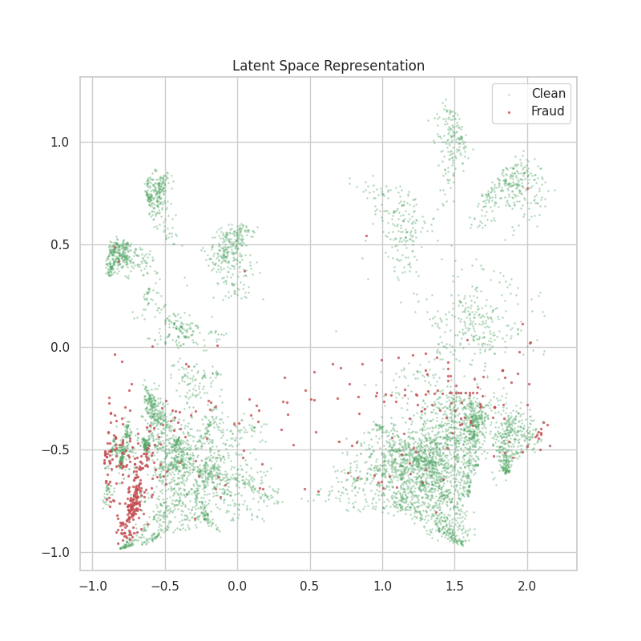

# Anamoly Detection using AutoEncoder - Credit Card Fraud Detection

In this repository, I have implemented the autoencoder for fraud detection in credit card. I studied about auto-encoders for this 
project and implemented it for this project. 

## About Autoencoders
Autoencoders are a type of neural network architecture comprising two main components: an encoder and a decoder. These components work in tandem to transform and reconstruct input data. Here's how it works:

- **Encoder**: The encoder takes the input data and compresses it, gradually reducing its dimensions until a bottleneck layer is reached. This bottleneck layer represents a compact representation of the input data.

- **Decoder**: The decoder then takes this compact representation and attempts to reconstruct the original input data. By comparing the input and output, we can measure how well the autoencoder is performing.

## Application in Credit Card Fraud Detection
Autoencoders are particularly well-suited for anomaly detection, such as identifying fraudulent credit card transactions:

- **Normal Transactions**: The autoencoder is trained on a dataset of legitimate, non-fraudulent transactions. It learns to capture the patterns and features typical of these transactions.

- **Anomalies (Fraudulent Transactions)**: When presented with new transactions, the autoencoder can detect anomalies by measuring the difference between the input data and its reconstruction. Unusual patterns, not captured during training, will result in a larger reconstruction error, signaling potential fraud.

## Some of the plots
**The initial 2d t-SNE**

**Latent Representation 2d**

*You can check other plots and code in the notebook itself*

**It is a basic implementation with a basic architecture. Feel free to tweak with the model.**

You can download the datastet from [https://www.kaggle.com/datasets/mlg-ulb/creditcardfraud](here).